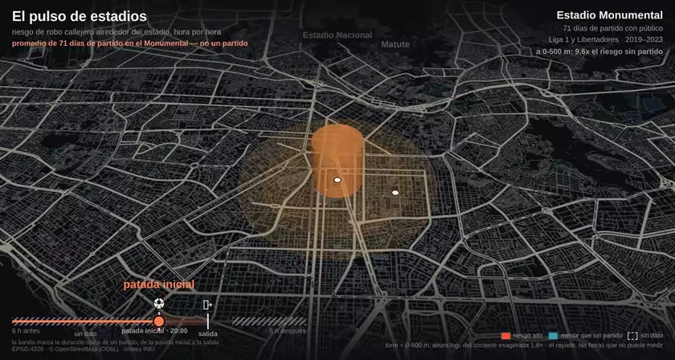
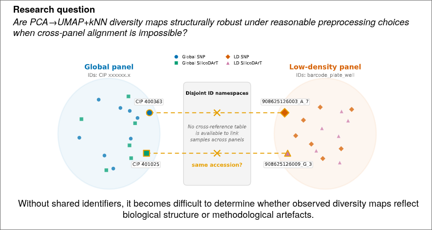
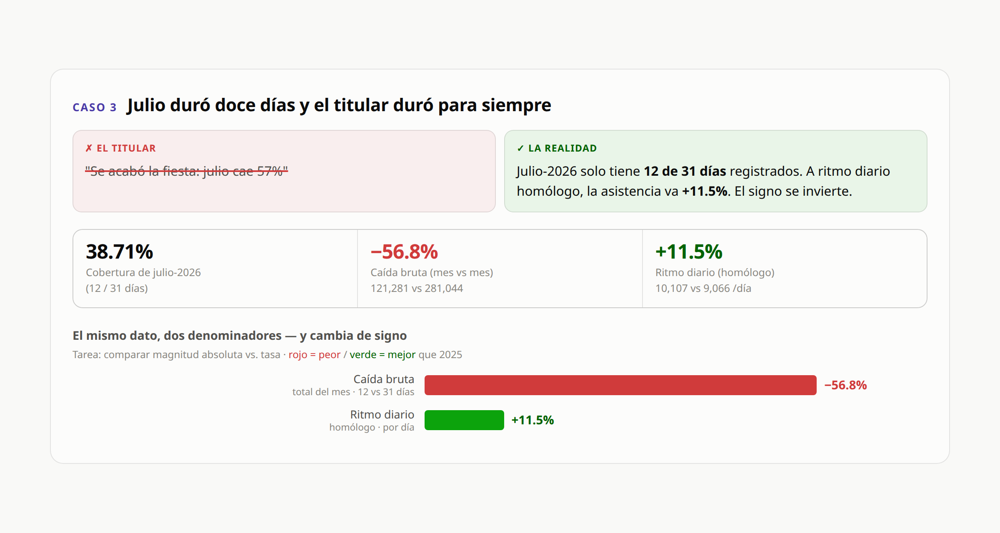

<!-- Badges flotando a la derecha del nombre. align="right" apila de derecha a
     izquierda, así que van en orden inverso: el primero queda en el extremo.
     hspace sobrevive al sanitizador de GitHub; vspace no.
     El nombre va antes que los badges: al revés, en móvil los floats le comen
     el ancho y el nombre se parte letra por letra. El   hace que el h1
     crezca si los badges bajan de línea, en vez de invadir el párrafo siguiente. -->
<h1>Rody Vilchez
  
  
  
   
</h1>

**Applied ML Engineer · AI Systems & Evaluation**

Agents in production at work, ML research on biased data outside it.
Both come down to the same question: how do you know it works?

At **CIP · CGIAR**, I build a hub-and-spoke multi-agent system for IT
support and the LLM-as-judge layer that evaluates it: regression tests
between versions, response quality, and agent behavior.

---

## Selected engineering & research

<table>
<tr>
<td width="50%" valign="top">

<h3 id="inwatch">InWatch</h3>

<b>Geospatial research</b> · Interactive experiments

A research workbench for crime-risk analysis under reporting bias.
Separates precomputed results from interactive views, with versioned
data contracts and code provenance. Spatial units are an explicit
experimental choice.

<b>Preview:</b> Estadio Monumental, averaged across 71 match days
with spectators in 2019–2023; patterns in reported street robberies.

<a href="https://github.com/R0SEWT/InWatch">Code &amp; experiments</a> ·
<a href="https://github.com/R0SEWT/InWatch/blob/main/registry/canonical_numbers.json">Results &amp; provenance</a> ·
<a href="https://github.com/R0SEWT/InWatch/blob/main/design/contrato-unidades.md">Spatial units &amp; assumptions</a>

</td>
<td width="50%" valign="top">

<h3 id="project-kit">project-kit</h3>

<b>Developer tooling</b> · Agent-assisted workflows

A Claude Code plugin that scaffolds a project with CI, a smoke test,
uv, issue tracking, and CLAUDE.md/AGENTS.md instructions for coding
agents. Non-destructive by default: it skips files that already exist.

<a href="https://github.com/R0SEWT/project-kit">Code &amp; setup</a> ·
<a href="https://github.com/R0SEWT/project-kit/blob/main/catalog/setup-options.md">Tooling research log</a>

</td>
</tr>
</table>

<!--
  Segunda fila = tabla aparte, a propósito, y ahora plegada.
  GitHub pinta tr:nth-child(2n) con fondo gris y no acepta atributos style,
  así que una tabla de 2x2 saldría con la fila de abajo tintada.
  Con una tabla por fila, cada <tr> es nth-child(1) y las cuatro cards
  quedan del mismo color.
-->

<b>More projects</b> · GENO-MAP, ChasquiFest Visual Audit

 

<table>
<tr>
<td width="50%" valign="top">

<h3 id="geno-map">GENO-MAP</h3>

<b>Scientific computing</b> · Research poster presented at SALA 2026

Validation of genetic diversity maps across panels with no shared
sample identifiers. Uses graph structure and robustness experiments to
assess sensitivity to preprocessing when direct alignment is unavailable.

<a href="https://github.com/R0SEWT/GENO-MAP_Correspondence-Free-Diagnostics-for-Sweet-Potato-Diversity-Maps">Code &amp; experiments</a> ·
<a href="https://github.com/R0SEWT/GENO-MAP_Correspondence-Free-Diagnostics-for-Sweet-Potato-Diversity-Maps/blob/main/docs/poster/poster_a1_v2.pdf">Poster</a> ·
<a href="https://github.com/R0SEWT/GENO-MAP_Correspondence-Free-Diagnostics-for-Sweet-Potato-Diversity-Maps/blob/main/docs/explainer-es.md">Explainer</a>

</td>
<td width="50%" valign="top">

<h3 id="chasquifest-visual-audit">ChasquiFest Visual Audit</h3>

<b>Data visualization</b> · Case study with synthetic data

Five visual audits of how coverage, denominators, and causal claims
affect interpretation. Each pairs the original claim with a corrected
comparison, backed by reproducible analysis and an interactive dashboard.

<a href="https://github.com/R0SEWT/chasquifest-auditoria-visual">Code &amp; analysis</a> ·
<a href="https://r0sewt.github.io/chasquifest-auditoria-visual/">Dashboard</a> ·
<a href="https://github.com/R0SEWT/chasquifest-auditoria-visual/blob/main/informe/informe.pdf">Report</a>

</td>
</tr>
</table>

---

<b>View tools</b>

 

**AI systems & evaluation** 
`LiteLLM` `OpenAI` `Anthropic` `Gemini` `LangGraph` `Claude Code` `MCP`

**Data & ML** 
`Python` `SQL` `Polars` `DuckDB` `PyTorch` `scikit-learn` `LightGBM` `SHAP`

**Geospatial & visualization** 
`GeoPandas` `H3` `pydeck` `Matplotlib` `Power BI`

**Engineering** 
`uv` `pytest` `Ruff` `GitHub Actions` `Docker` `FastAPI` `Azure`

---

## GitHub activity

<!-- align="top" en ambas: la card de lenguajes es más baja y sin esto queda
     flotando al medio de la de stats. -->

  
  

