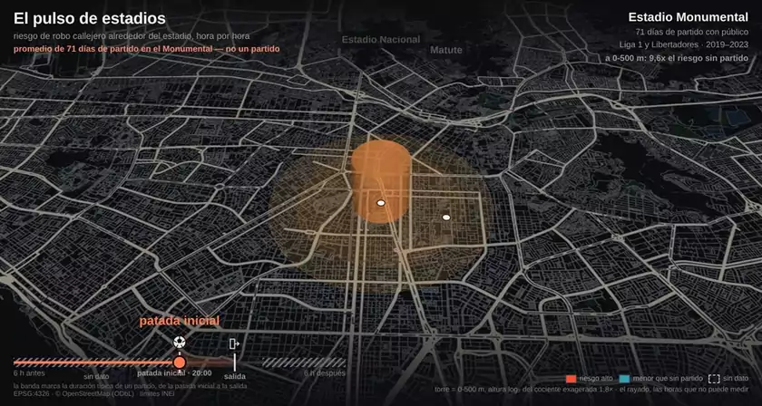
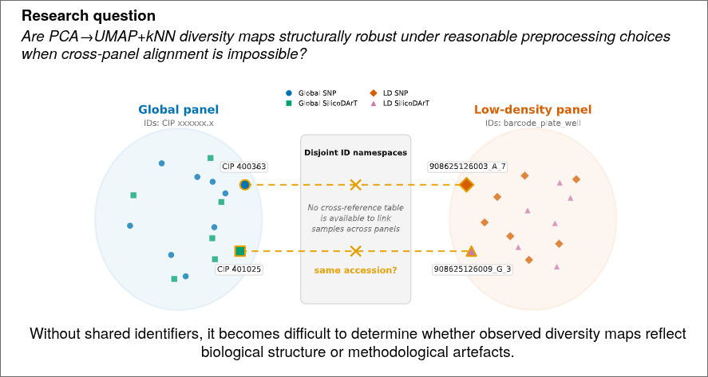
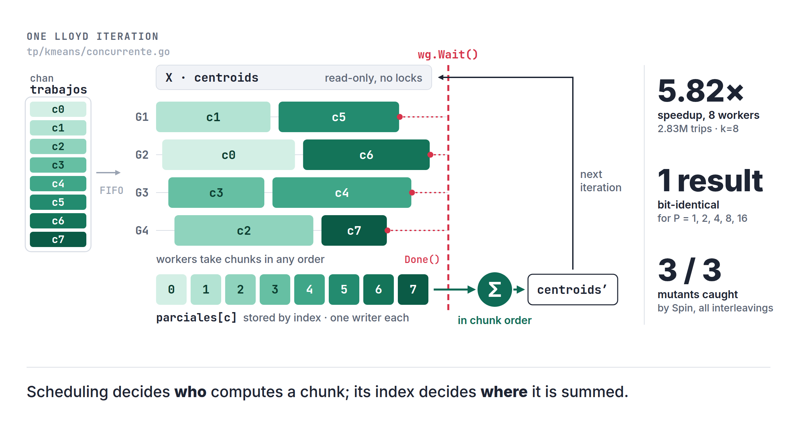

<!-- Badges en un bloque alineado a la derecha, bajo el nombre. Antes flotaban
     con align="right" y en móvil caían en escalera (cada float busca su hueco);
     como texto en línea dentro de un 
 bajan de fila juntos
     y en orden. El contador es de komarev: cambiar de servicio o de username
     reinicia la cuenta. Cada carga suma una visita: al previsualizar, simularlo. -->
<h1>Rody Vilchez
  

    
    
    
  

</h1>

**Applied ML Engineer · AI Systems & Evaluation**

Agents in production at work, ML research on biased data outside it.
Both come down to the same question: how do you know it works?

At **CIP · CGIAR**, I build a hub-and-spoke multi-agent system for IT
support and the LLM-as-judge layer that evaluates it: regression tests
between versions, response quality, and agent behavior.

---

## Selected engineering & research

<table>
<tr>
<td width="50%" valign="top">

<h3 id="inwatch">InWatch</h3>

<b>Geospatial research</b> · Interactive experiments

A research workbench for crime-risk analysis under reporting bias.
Separates precomputed results from interactive views, with versioned
data contracts and code provenance. Spatial units are an explicit
experimental choice.

<b>Preview:</b> Estadio Monumental, averaged across 71 match days
with spectators in 2019–2023; patterns in reported street robberies.

<a href="https://github.com/R0SEWT/InWatch">Code &amp; experiments</a> ·
<a href="https://github.com/R0SEWT/InWatch/blob/main/registry/canonical_numbers.json">Results &amp; provenance</a> ·
<a href="https://github.com/R0SEWT/InWatch/blob/main/design/contrato-unidades.md">Spatial units &amp; assumptions</a>

</td>
<td width="50%" valign="top">

<h3 id="project-kit">project-kit</h3>

<b>Developer tooling</b> · Agent-assisted workflows

A Claude Code plugin that scaffolds a project with CI, a smoke test,
uv, issue tracking, and CLAUDE.md/AGENTS.md instructions for coding
agents. Non-destructive by default: it skips files that already exist.

<a href="https://github.com/R0SEWT/project-kit">Code &amp; setup</a> ·
<a href="https://github.com/R0SEWT/project-kit/blob/main/catalog/setup-options.md">Tooling research log</a>

</td>
</tr>
</table>

<!--
  Segunda fila = tabla aparte, a propósito, y ahora plegada.
  GitHub pinta tr:nth-child(2n) con fondo gris y no acepta atributos style,
  así que una tabla de 2x2 saldría con la fila de abajo tintada.
  Con una tabla por fila, cada <tr> es nth-child(1) y las cuatro cards
  quedan del mismo color.
-->

<b>More projects</b> · GENO-MAP, concurrente

 

<table>
<tr>
<td width="50%" valign="top">

<h3 id="geno-map">GENO-MAP</h3>

<b>Scientific computing</b> · Research poster presented at SALA 2026

Validation of genetic diversity maps across panels with no shared
sample identifiers. Uses graph structure and robustness experiments to
assess sensitivity to preprocessing when direct alignment is unavailable.

<a href="https://github.com/R0SEWT/GENO-MAP_Correspondence-Free-Diagnostics-for-Sweet-Potato-Diversity-Maps">Code &amp; experiments</a> ·
<a href="https://github.com/R0SEWT/GENO-MAP_Correspondence-Free-Diagnostics-for-Sweet-Potato-Diversity-Maps/blob/main/docs/poster/poster_a1_v2.pdf">Poster</a> ·
<a href="https://github.com/R0SEWT/GENO-MAP_Correspondence-Free-Diagnostics-for-Sweet-Potato-Diversity-Maps/blob/main/docs/explainer-es.md">Explainer</a>

</td>
<td width="50%" valign="top">

<h3 id="concurrente">concurrente</h3>

<b>Concurrent systems</b> · Go worker pool, model-checked with Spin

Lloyd's K-means over 2.8M NYC taxi trips, sequential and with a
persistent worker pool. Partials are reduced in chunk order, so the result
is bit-identical for any worker count. Spin checks the synchronization over
every interleaving; benchmarks run on four machines, from a server to a phone.

<a href="https://github.com/R0SEWT/concurrente">Code &amp; benchmarks</a> ·
<a href="https://github.com/R0SEWT/concurrente/blob/main/tp/spin/README.md">Spin model</a> ·
<a href="https://github.com/R0SEWT/concurrente/blob/main/tp/docs/analisis-pc2.md">Speedup analysis</a>

</td>
</tr>
</table>

---

<b>View tools</b>

 

**AI systems & evaluation** 
`LiteLLM` `OpenAI` `Anthropic` `Gemini` `LangGraph` `Claude Code` `MCP`

**Data & ML** 
`Python` `SQL` `Polars` `DuckDB` `PyTorch` `scikit-learn` `LightGBM` `SHAP`

**Geospatial & visualization** 
`GeoPandas` `H3` `pydeck` `Matplotlib` `Power BI`

**Engineering** 
`uv` `pytest` `Ruff` `GitHub Actions` `Docker` `FastAPI` `Azure`

---

## GitHub activity

<!-- align="top" en ambas: la card de lenguajes es más baja y sin esto queda
     flotando al medio de la de stats.
     <picture>: tema algolia en modo oscuro, default en claro (el fondo azul fijo
     chocaba con la página blanca). Ancho en px, no en %: en escritorio caben
     lado a lado (450 + 300) y en móvil bajan una por fila a ancho completo, en
     vez de encogerse juntas hasta no leerse. En srcset las comas separan
     candidatos, así que el hide= va con %2C. -->

  <picture>
    <source media="(prefers-color-scheme: dark)" srcset="https://github-stats-iota-ten.vercel.app/api?username=r0sewt&theme=algolia&hide_border=true&include_all_commits=true&count_private=true" />
    
  </picture>
  <picture>
    <source media="(prefers-color-scheme: dark)" srcset="https://github-stats-iota-ten.vercel.app/api/top-langs/?username=r0sewt&theme=algolia&hide_border=true&layout=compact&count_private=true&hide=html%2Cjupyter%20notebook%2Cc%2Ccss%2Cc%2B%2B" />
    
  </picture>

